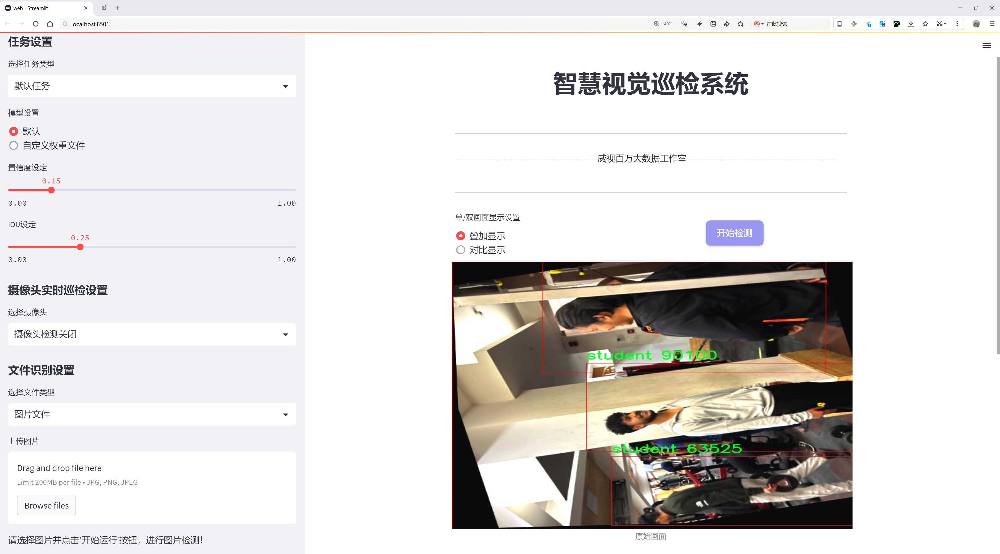
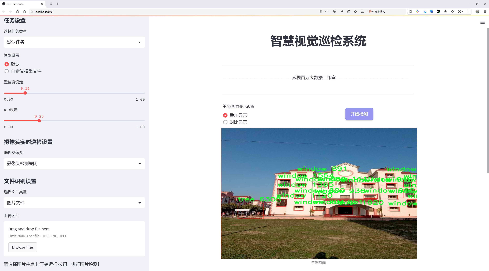
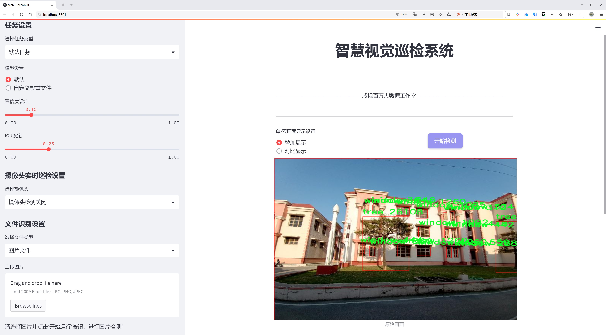
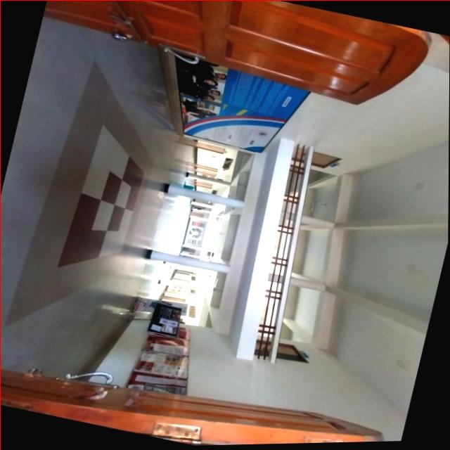
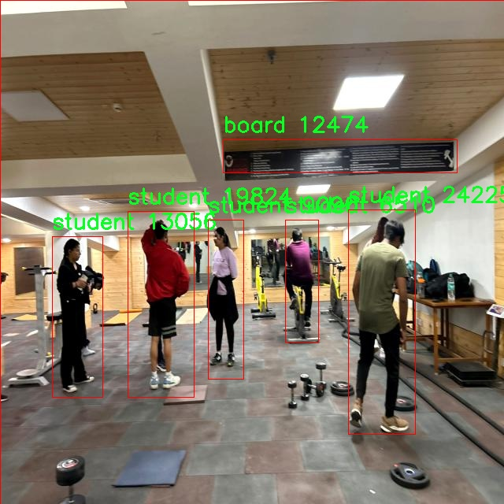
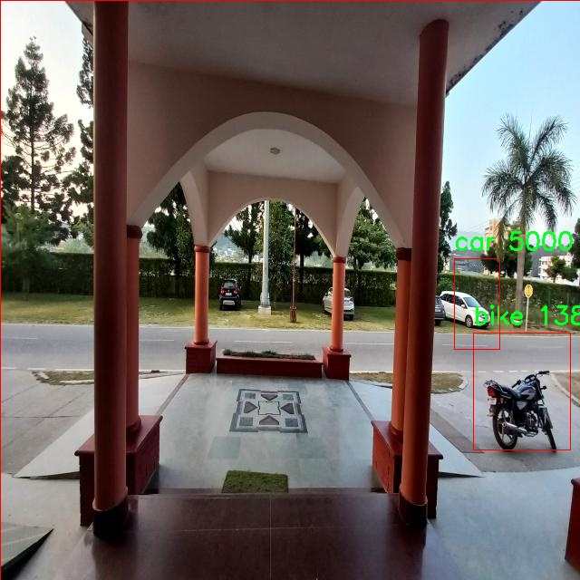
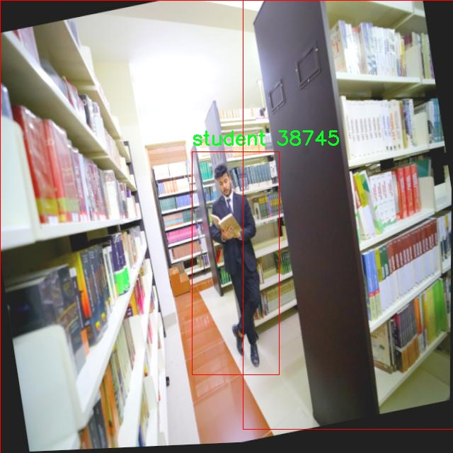
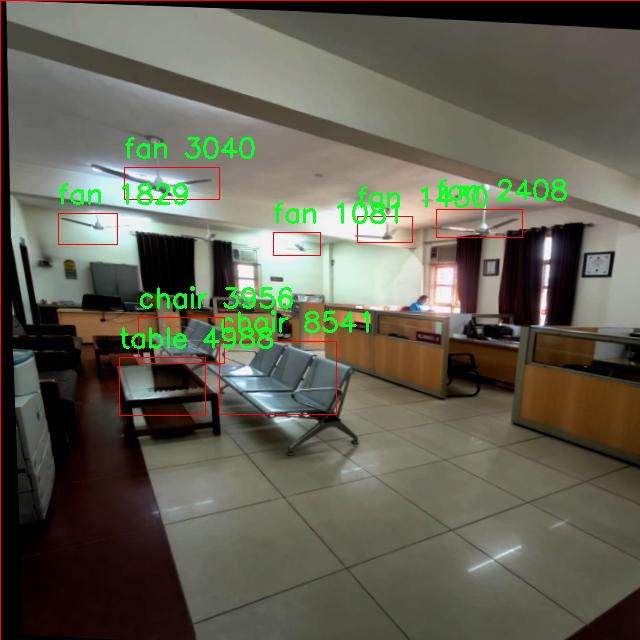

# 校园场景物体检测检测系统源码分享
 # [一条龙教学YOLOV8标注好的数据集一键训练_70+全套改进创新点发刊_Web前端展示]

### 1.研究背景与意义

项目参考[AAAI Association for the Advancement of Artificial Intelligence](https://gitee.com/qunmasj/projects)

项目来源[AACV Association for the Advancement of Computer Vision](https://kdocs.cn/l/cszuIiCKVNis)

研究背景与意义

随着人工智能技术的迅猛发展，计算机视觉在各个领域的应用日益广泛，尤其是在物体检测方面。物体检测技术不仅能够提升安全监控、智能交通等系统的效率，还能够为校园管理提供有力支持。校园作为一个复杂的多功能环境，涵盖了教室、图书馆、宿舍、食堂等多种场景，物体检测技术在校园场景中的应用具有重要的现实意义。

本研究旨在基于改进的YOLOv8模型，构建一个高效的校园场景物体检测系统。YOLO（You Only Look Once）系列模型因其实时性和高精度而受到广泛关注。YOLOv8作为该系列的最新版本，具备更强的特征提取能力和更快的推理速度，适合处理复杂的校园环境。在本研究中，我们将针对校园场景的特定需求，对YOLOv8进行改进，以提高其在多类别物体检测中的表现。

本研究所使用的数据集包含3300张图像，涵盖60个类别的物体。这些类别包括校园内常见的建筑物（如行政楼、图书馆、宿舍等）、设施（如篮球场、健身房、停车场等）以及校园生活中常见的物品（如书籍、桌椅、电脑等）。如此丰富的类别设置，使得该数据集能够有效地反映校园环境的多样性，为物体检测模型的训练提供了良好的基础。

在实际应用中，校园场景物体检测系统可以帮助学校管理者实时监控校园内的人员流动、设施使用情况，及时发现并处理潜在的安全隐患。例如，通过对学生在图书馆、食堂等公共区域的行为进行分析，学校可以优化资源配置，提高服务质量。此外，该系统还可以为校园安全提供技术支持，通过对异常行为的自动识别，提升校园的安全防范能力。

从学术角度来看，本研究不仅丰富了物体检测领域的研究内容，还为YOLOv8模型的改进提供了新的思路。通过对校园场景的深入分析，我们可以探索物体检测在特定环境下的应用潜力，为后续研究提供借鉴。此外，本研究还将为相关领域的研究者提供一个实用的数据集，促进学术界与工业界的交流与合作。

综上所述，基于改进YOLOv8的校园场景物体检测系统的研究具有重要的理论价值和实际意义。它不仅能够提升校园管理的智能化水平，还为物体检测技术在特定场景下的应用提供了新的视角。通过本研究，我们希望能够推动校园智能管理的发展，为创建安全、便捷的校园环境贡献力量。

### 2.图片演示







##### 注意：由于此博客编辑较早，上面“2.图片演示”和“3.视频演示”展示的系统图片或者视频可能为老版本，新版本在老版本的基础上升级如下：（实际效果以升级的新版本为准）

  （1）适配了YOLOV8的“目标检测”模型和“实例分割”模型，通过加载相应的权重（.pt）文件即可自适应加载模型。

  （2）支持“图片识别”、“视频识别”、“摄像头实时识别”三种识别模式。

  （3）支持“图片识别”、“视频识别”、“摄像头实时识别”三种识别结果保存导出，解决手动导出（容易卡顿出现爆内存）存在的问题，识别完自动保存结果并导出到tempDir中。

  （4）支持Web前端系统中的标题、背景图等自定义修改，后面提供修改教程。

  另外本项目提供训练的数据集和训练教程,暂不提供权重文件（best.pt）,需要您按照教程进行训练后实现图片演示和Web前端界面演示的效果。

### 3.视频演示

[3.1 视频演示](https://www.bilibili.com/video/BV1nMtyeWEhn/)

### 4.数据集信息展示

##### 4.1 本项目数据集详细数据（类别数＆类别名）

nc: 55
names: ['1-adminblock', '16-School of Applied and Life Science', '2-University-Hostel', '21-Student Parking', '25-University Canteens_Food Courts', '28-University Mechanical Workshop', '4-Central Library', '4-auditorium', 'Basket Ball', 'Civil-Department', 'Ground', 'Institute of Pharmaceutical Sciences', 'Law-College-Dehradun', 'Memorial Wall', 'School of Agriculture', 'TREE', 'University Basket Ball Court', 'University-Gym', 'Uttaranchal-Institute-of-Technology', 'Uttaranchal-college-of-Nursing', 'Uttaranchal-institute-of-management', 'Uttaranchal-school-of-computing-Sciences', 'Uttaranchal_Institute_of_Pharmaceutical_Sciences', 'ac', 'aerospace-dept', 'almirah', 'badminton court', 'bag', 'bike', 'board', 'book', 'car', 'central', 'chair', 'computer-center', 'counter', 'desktop', 'door', 'dustbeen', 'fan', 'fire', 'flagpole', 'library', 'main-gate', 'photo', 'rack', 'racket', 'scooter', 'sofa', 'stair', 'student', 'table', 'tree', 'university-logo', 'window']


##### 4.2 本项目数据集信息介绍

数据集信息展示

在本研究中，我们采用了名为“Nitin”的数据集，以训练和改进YOLOv8的校园场景物体检测系统。该数据集的设计旨在捕捉校园环境中的多样化物体，涵盖了55个不同的类别，充分反映了校园生活的复杂性和多样性。这些类别不仅包括建筑物和设施，还涵盖了校园内常见的物品和活动场景，为模型的训练提供了丰富的上下文信息。

数据集中包含的类别从行政楼到各个学院、食堂、图书馆等基础设施，展示了校园的多元化功能。例如，“1-adminblock”代表行政楼，通常是学生和教职工办理各类事务的中心；而“4-Central Library”则是知识获取的重要场所，学生们在这里进行学习和研究。此外，数据集中还包括“16-School of Applied and Life Science”和“Law-College-Dehradun”等学院，体现了校园的学术多样性。

除了建筑物和学院，数据集还涵盖了许多校园内常见的物品和设施，如“desk”、“chair”、“computer-center”等。这些类别不仅是校园生活的基本组成部分，也为物体检测模型提供了重要的训练样本。通过识别这些物体，模型能够更好地理解和分析校园环境的结构和功能。

此外，数据集中还包含了许多与校园活动相关的类别，如“Basket Ball”、“badminton court”和“University Basket Ball Court”。这些类别不仅展示了校园的体育设施，还反映了学生们的课外活动和社交生活。通过对这些动态场景的检测，模型能够捕捉到校园生活的活力和多样性。

在物体检测的过程中，数据集中的“student”、“bike”、“car”等类别为模型提供了对校园人群和交通工具的识别能力。这些元素在校园环境中频繁出现，能够帮助模型在复杂的场景中进行有效的物体识别和分类。

值得注意的是，数据集中的“TREE”、“flagpole”和“main-gate”等类别则为模型提供了对校园环境中自然和人工元素的理解。这些元素不仅丰富了数据集的多样性，也为模型提供了更广泛的背景信息，帮助其在不同的场景中进行准确的物体检测。

总的来说，“Nitin”数据集通过其丰富的类别和多样的场景，为YOLOv8的训练提供了坚实的基础。通过对校园环境中各种物体的有效识别和分类，该数据集不仅能够提升物体检测模型的性能，还能为后续的研究和应用提供重要的数据支持。随着校园场景物体检测技术的不断进步，基于“Nitin”数据集的研究将为智能校园的建设和管理提供新的思路和方法。











### 5.全套项目环境部署视频教程（零基础手把手教学）

[5.1 环境部署教程链接（零基础手把手教学）](https://www.ixigua.com/7404473917358506534?logTag=c807d0cbc21c0ef59de5)


[5.2 安装Python虚拟环境创建和依赖库安装视频教程链接（零基础手把手教学）](https://www.ixigua.com/7404474678003106304?logTag=1f1041108cd1f708b01a)

### 6.手把手YOLOV8训练视频教程（零基础小白有手就能学会）

[6.1 手把手YOLOV8训练视频教程（零基础小白有手就能学会）](https://www.ixigua.com/7404477157818401292?logTag=d31a2dfd1983c9668658)

### 7.70+种全套YOLOV8创新点代码加载调参视频教程（一键加载写好的改进模型的配置文件）

[7.1 70+种全套YOLOV8创新点代码加载调参视频教程（一键加载写好的改进模型的配置文件）](https://www.ixigua.com/7404478314661806627?logTag=29066f8288e3f4eea3a4)

### 8.70+种全套YOLOV8创新点原理讲解（非科班也可以轻松写刊发刊，V10版本正在科研待更新）

由于篇幅限制，每个创新点的具体原理讲解就不一一展开，具体见下列网址中的创新点对应子项目的技术原理博客网址【Blog】：


[8.1 70+种全套YOLOV8创新点原理讲解链接](https://gitee.com/qunmasj/good)

### 9.系统功能展示（检测对象为举例，实际内容以本项目数据集为准）

图9.1.系统支持检测结果表格显示

  图9.2.系统支持置信度和IOU阈值手动调节

  图9.3.系统支持自定义加载权重文件best.pt(需要你通过步骤5中训练获得)

  图9.4.系统支持摄像头实时识别

  图9.5.系统支持图片识别

  图9.6.系统支持视频识别

  图9.7.系统支持识别结果文件自动保存

  图9.8.系统支持Excel导出检测结果数据


### 10.原始YOLOV8算法原理

原始YOLOv8算法原理

YOLOv8算法作为YOLO系列中的最新版本，标志着目标检测技术的又一次重要进步。其设计理念不仅继承了前几代YOLO算法的优点，还在多个关键方面进行了创新和优化，使其在检测精度和速度上都表现出色。YOLOv8的架构主要由输入层、主干网络、颈部网络和头部网络四个核心部分构成，这种结构的设计使得算法能够高效地处理图像数据，并提取出丰富的特征信息。

在输入层，YOLOv8首先对输入图像进行预处理，包括调整图像比例和进行Mosaic增强。这一过程不仅提高了模型对不同场景的适应能力，还有效地增加了训练样本的多样性，从而提升了模型的泛化能力。Mosaic增强技术通过将多张图像拼接在一起，生成新的训练样本，使得模型能够学习到更多的背景信息和目标特征。

主干网络是YOLOv8的核心组成部分，负责对输入图像进行特征提取。与之前的YOLOv5相比，YOLOv8在主干网络中采用了C2f模块，这一模块的设计灵感来源于YOLOv7中的E-ELAN结构。C2f模块通过跨层分支连接的方式，增强了模型的梯度流动，改善了特征提取的效果。这种结构的引入，使得YOLOv8能够在保持轻量级特性的同时，获得更丰富的特征信息。此外，主干网络还保留了空间金字塔池化（SPP）模块，通过不同内核尺寸的池化操作，进一步增强了网络对多尺度特征的抽象能力。

在特征融合方面，YOLOv8的颈部网络采用了双塔结构，结合了特征金字塔网络（FPN）和路径聚合网络（PAN）。这种设计使得不同尺度的特征图能够有效地融合，从而促进了语义信息和定位信息的转移，增强了网络对不同尺度目标的检测能力。通过这种特征融合策略，YOLOv8能够更好地捕捉到目标的细节信息，提高了检测的准确性。

YOLOv8的头部网络则采用了解耦的检测头结构，将回归分支和分类分支分离开来。这样的设计不仅加速了模型的收敛速度，还提高了检测的精度。在解耦头中，YOLOv8通过两个并行的卷积分支分别计算回归和类别的损失，使得模型在进行目标检测时能够更加专注于每个任务，从而提升了整体性能。

值得一提的是，YOLOv8在损失函数的设计上也进行了创新。它引入了变焦损失策略来计算分类损失，同时采用数据平均保真度损失和完美交并比损失来计算边界框损失。这种新的损失策略使得YOLOv8在处理目标检测任务时，能够更加准确地评估模型的性能，从而进一步提升了检测效果。

综上所述，YOLOv8算法通过对主干网络、特征融合和检测头等多个模块的优化，成功地在保持高效性的同时，提升了目标检测的准确性。其创新的设计理念和技术手段，使得YOLOv8在众多目标检测算法中脱颖而出，成为当前最优秀的目标检测算法之一。随着YOLOv8的不断发展和应用，其在实际场景中的表现将更加令人期待，尤其是在需要高效、准确目标检测的领域，如自动驾驶、安防监控和智能制造等。通过进一步的研究和改进，YOLOv8有望在未来的目标检测任务中发挥更大的作用，为相关行业带来更多的便利和创新。


### 11.项目核心源码讲解（再也不用担心看不懂代码逻辑）

#### 11.1 code\ultralytics\solutions\__init__.py

当然可以！不过你提供的代码片段非常简短，仅包含了一个注释行，并没有具体的实现代码。如果你有更详细的代码或文件内容，请提供，我将会对其进行分析并保留核心部分，同时添加详细的中文注释。

该文件是Ultralytics YOLO项目的一部分，文件名为`__init__.py`，通常用于标识一个Python包。文件中包含的代码是一个注释，表明该项目使用的是AGPL-3.0许可证，并且与Ultralytics YOLO相关。

Ultralytics YOLO是一个用于目标检测的深度学习框架，YOLO（You Only Look Once）是一种流行的实时目标检测算法。AGPL-3.0许可证是一种开源许可证，允许用户自由使用、修改和分发软件，但要求在分发时也要公开源代码。

虽然该文件没有包含具体的实现代码，但它的存在是为了确保Python解释器将其所在的目录视为一个包，使得可以在其他模块中导入该包的功能。通常，`__init__.py`文件还可以用于初始化包的内容，例如定义包的公共接口或导入其他模块。

总的来说，这个文件的主要作用是标识包，并提供许可证信息，确保用户了解使用该软件的条款。

#### 11.2 ui.py

```python
import sys
import subprocess

def run_script(script_path):
    """
    使用当前 Python 环境运行指定的脚本。

    Args:
        script_path (str): 要运行的脚本路径

    Returns:
        None
    """
    # 获取当前 Python 解释器的路径
    python_path = sys.executable

    # 构建运行命令，使用 streamlit 运行指定的脚本
    command = f'"{python_path}" -m streamlit run "{script_path}"'

    # 执行命令并等待其完成
    result = subprocess.run(command, shell=True)
    
    # 检查命令执行结果，如果返回码不为0，则表示出错
    if result.returncode != 0:
        print("脚本运行出错。")


# 主程序入口
if __name__ == "__main__":
    # 指定要运行的脚本路径
    script_path = "web.py"  # 假设脚本在当前目录下

    # 调用函数运行脚本
    run_script(script_path)
```

### 代码核心部分注释：
1. **导入模块**：
   - `sys`：用于获取当前 Python 解释器的路径。
   - `subprocess`：用于执行外部命令。

2. **定义 `run_script` 函数**：
   - 此函数接收一个脚本路径作为参数，并使用当前 Python 环境运行该脚本。
   - 通过 `sys.executable` 获取当前 Python 解释器的路径。
   - 构建命令字符串，使用 `streamlit` 模块运行指定的脚本。
   - 使用 `subprocess.run` 执行命令，并等待其完成。
   - 检查命令的返回码，如果不为0，则输出错误信息。

3. **主程序入口**：
   - 在 `if __name__ == "__main__":` 块中，指定要运行的脚本路径（此处假设为 "web.py"）。
   - 调用 `run_script` 函数，执行指定的脚本。

这个程序文件的主要功能是使用当前的 Python 环境来运行一个指定的脚本，具体来说是一个名为 `web.py` 的脚本。首先，程序导入了必要的模块，包括 `sys`、`os` 和 `subprocess`，这些模块提供了与系统交互和执行外部命令的功能。此外，还导入了 `abs_path` 函数，这个函数来自于 `QtFusion.path` 模块，用于获取文件的绝对路径。

在 `run_script` 函数中，首先获取当前 Python 解释器的路径，存储在 `python_path` 变量中。接着，构建一个命令字符串，该命令用于运行 `streamlit`，这是一个用于构建数据应用的框架。命令的格式是 `python -m streamlit run script_path`，其中 `script_path` 是要运行的脚本的路径。

然后，使用 `subprocess.run` 方法执行这个命令。这个方法会在一个新的 shell 中运行命令，并等待其完成。如果命令执行的返回码不为零，表示脚本运行出错，程序会打印出错误信息。

在文件的最后部分，使用 `if __name__ == "__main__":` 语句来确保只有在直接运行该文件时才会执行下面的代码。这里指定了要运行的脚本路径为 `web.py`，并调用 `run_script` 函数来执行这个脚本。

总体来说，这个程序的作用是简化了在命令行中手动运行 `web.py` 脚本的过程，用户只需运行 `ui.py` 文件，程序会自动处理脚本的执行。

#### 11.3 70+种YOLOv8算法改进源码大全和调试加载训练教程（非必要）\ultralytics\data\dataset.py

以下是经过简化和注释的核心代码部分，主要集中在 `YOLODataset` 类及其关键方法上。

```python
import numpy as np
import torch
from pathlib import Path
from ultralytics.utils import TQDM, LOGGER, get_hash, img2label_paths, verify_image_label

# Ultralytics 数据集缓存版本
DATASET_CACHE_VERSION = '1.0.3'

class YOLODataset:
    """
    YOLO 数据集类，用于加载目标检测和/或分割标签。
    """

    def __init__(self, data=None, use_segments=False, use_keypoints=False):
        """初始化 YOLODataset，配置分割和关键点选项。"""
        self.use_segments = use_segments  # 是否使用分割掩码
        self.use_keypoints = use_keypoints  # 是否使用关键点
        self.data = data  # 数据集配置
        assert not (self.use_segments and self.use_keypoints), '不能同时使用分割和关键点。'

    def cache_labels(self, path=Path('./labels.cache')):
        """
        缓存数据集标签，检查图像并读取形状。

        Args:
            path (Path): 缓存文件保存路径 (默认: Path('./labels.cache')).
        Returns:
            (dict): 标签字典。
        """
        x = {'labels': []}  # 初始化标签字典
        nm, nf, ne, nc, msgs = 0, 0, 0, 0, []  # 统计信息：缺失、找到、空、损坏的图像数量
        total = len(self.im_files)  # 图像总数

        # 使用多线程验证图像和标签
        with ThreadPool(NUM_THREADS) as pool:
            results = pool.imap(func=verify_image_label,
                                iterable=zip(self.im_files, self.label_files))
            pbar = TQDM(results, desc='扫描标签...', total=total)
            for im_file, lb, shape, segments, keypoint, nm_f, nf_f, ne_f, nc_f, msg in pbar:
                nm += nm_f
                nf += nf_f
                ne += ne_f
                nc += nc_f
                if im_file:
                    x['labels'].append(
                        dict(
                            im_file=im_file,
                            shape=shape,
                            cls=lb[:, 0:1],  # 类别
                            bboxes=lb[:, 1:],  # 边界框
                            segments=segments,
                            keypoints=keypoint,
                            normalized=True,
                            bbox_format='xywh'))  # 边界框格式
                if msg:
                    msgs.append(msg)
                pbar.desc = f'扫描标签... {nf} 图像, {nm + ne} 背景, {nc} 损坏'
            pbar.close()

        if msgs:
            LOGGER.info('\n'.join(msgs))  # 记录警告信息
        x['hash'] = get_hash(self.label_files + self.im_files)  # 计算标签文件和图像文件的哈希值
        save_dataset_cache_file(self.prefix, path, x)  # 保存缓存文件
        return x

    def get_labels(self):
        """返回 YOLO 训练的标签字典。"""
        self.label_files = img2label_paths(self.im_files)  # 获取标签文件路径
        cache_path = Path(self.label_files[0]).parent.with_suffix('.cache')  # 缓存文件路径

        # 尝试加载缓存文件
        try:
            cache = load_dataset_cache_file(cache_path)
            assert cache['version'] == DATASET_CACHE_VERSION  # 检查版本
            assert cache['hash'] == get_hash(self.label_files + self.im_files)  # 检查哈希值
        except (FileNotFoundError, AssertionError):
            cache = self.cache_labels(cache_path)  # 如果加载失败，则缓存标签

        labels = cache['labels']  # 获取标签
        if not labels:
            LOGGER.warning(f'警告 ⚠️ 在 {cache_path} 中未找到图像，训练可能无法正常工作。')
        self.im_files = [lb['im_file'] for lb in labels]  # 更新图像文件列表
        return labels  # 返回标签

    def build_transforms(self, hyp=None):
        """构建并返回数据增强变换列表。"""
        transforms = []  # 初始化变换列表
        # 根据配置添加不同的变换
        transforms.append(
            Format(bbox_format='xywh', normalize=True, return_mask=self.use_segments, return_keypoint=self.use_keypoints))
        return transforms  # 返回变换列表

# 其他辅助函数
def load_dataset_cache_file(path):
    """从路径加载 Ultralytics *.cache 字典。"""
    cache = np.load(str(path), allow_pickle=True).item()  # 加载缓存字典
    return cache

def save_dataset_cache_file(prefix, path, x):
    """将 Ultralytics 数据集 *.cache 字典保存到路径。"""
    x['version'] = DATASET_CACHE_VERSION  # 添加缓存版本
    np.save(str(path), x)  # 保存缓存
    LOGGER.info(f'{prefix} 新缓存创建: {path}')  # 记录缓存创建信息
```

### 代码注释说明：
1. **YOLODataset 类**：该类用于处理 YOLO 格式的数据集，支持目标检测和分割任务。
2. **cache_labels 方法**：负责缓存标签，检查图像的有效性，并记录相关信息。
3. **get_labels 方法**：获取标签，尝试加载缓存文件，如果失败则重新缓存标签。
4. **build_transforms 方法**：构建数据增强的变换列表，返回用于训练的变换。
5. **load_dataset_cache_file 和 save_dataset_cache_file 函数**：用于加载和保存数据集的缓存文件，优化数据加载速度。

这个程序文件是用于处理YOLOv8算法的数据集加载和管理，主要包括对象检测和分类任务的数据集。文件中定义了多个类和函数，以便于加载、缓存和处理数据集。

首先，文件导入了一些必要的库，包括用于图像处理的OpenCV、NumPy和PyTorch等。接着，定义了一个`YOLODataset`类，继承自`BaseDataset`，用于加载YOLO格式的对象检测和分割标签。这个类的构造函数接受多个参数，包括数据集的配置、是否使用分割掩码和关键点等。它确保在同一时间内只能使用分割或关键点标签，不能同时使用。

`YOLODataset`类中有一个`cache_labels`方法，用于缓存数据集标签，检查图像的有效性并读取图像的形状。该方法使用多线程来提高处理速度，并在处理过程中提供进度条。它会生成一个缓存文件，记录标签信息和处理结果，以便后续使用。

`get_labels`方法用于获取YOLO训练所需的标签。它尝试加载缓存文件，如果缓存文件不存在或不匹配，则调用`cache_labels`方法重新生成缓存。此方法还会检查数据集中的标签是否完整，并返回标签的字典。

`build_transforms`方法用于构建数据增强的转换操作，支持多种增强方式，如马赛克、混合等。`close_mosaic`方法则是将马赛克和其他增强选项设置为0，以便在某些情况下使用。

此外，`update_labels_info`方法允许用户自定义标签格式，将标签信息整理成`Instances`对象。`collate_fn`方法用于将数据样本合并成批次，以便于训练时使用。

接下来，文件中还定义了一个`ClassificationDataset`类，继承自`torchvision.datasets.ImageFolder`，用于处理YOLO分类数据集。这个类支持图像的缓存、数据增强和图像验证等功能。它的`__getitem__`方法用于返回指定索引的样本数据，支持从内存或磁盘加载图像。

`verify_images`方法用于验证数据集中所有图像的有效性，并在需要时生成缓存文件。

最后，文件中定义了`load_dataset_cache_file`和`save_dataset_cache_file`两个函数，用于加载和保存数据集的缓存文件，确保数据集的快速访问和处理。

整体而言，这个程序文件提供了一个完整的数据集管理框架，支持YOLOv8算法的训练和测试，能够高效地处理图像数据和标签信息。

#### 11.4 train.py

以下是经过简化和注释的核心代码部分：

```python
import random
import numpy as np
import torch.nn as nn
from ultralytics.data import build_dataloader, build_yolo_dataset
from ultralytics.engine.trainer import BaseTrainer
from ultralytics.models import yolo
from ultralytics.nn.tasks import DetectionModel
from ultralytics.utils import LOGGER, RANK
from ultralytics.utils.torch_utils import de_parallel, torch_distributed_zero_first

class DetectionTrainer(BaseTrainer):
    """
    扩展自 BaseTrainer 类，用于基于检测模型的训练。
    """

    def build_dataset(self, img_path, mode="train", batch=None):
        """
        构建 YOLO 数据集。

        参数:
            img_path (str): 包含图像的文件夹路径。
            mode (str): 模式为 `train` 或 `val`，用户可以为每种模式自定义不同的增强。
            batch (int, optional): 批次大小，适用于 `rect` 模式。默认为 None。
        """
        gs = max(int(de_parallel(self.model).stride.max() if self.model else 0), 32)  # 获取模型的最大步幅
        return build_yolo_dataset(self.args, img_path, batch, self.data, mode=mode, rect=mode == "val", stride=gs)

    def get_dataloader(self, dataset_path, batch_size=16, rank=0, mode="train"):
        """构造并返回数据加载器。"""
        assert mode in ["train", "val"]  # 确保模式有效
        with torch_distributed_zero_first(rank):  # 在分布式训练中仅初始化一次数据集
            dataset = self.build_dataset(dataset_path, mode, batch_size)
        shuffle = mode == "train"  # 训练模式下打乱数据
        workers = self.args.workers if mode == "train" else self.args.workers * 2  # 设置工作线程数
        return build_dataloader(dataset, batch_size, workers, shuffle, rank)  # 返回数据加载器

    def preprocess_batch(self, batch):
        """对图像批次进行预处理，包括缩放和转换为浮点数。"""
        batch["img"] = batch["img"].to(self.device, non_blocking=True).float() / 255  # 将图像转换为浮点数并归一化
        if self.args.multi_scale:  # 如果启用多尺度
            imgs = batch["img"]
            sz = (
                random.randrange(self.args.imgsz * 0.5, self.args.imgsz * 1.5 + self.stride)
                // self.stride
                * self.stride
            )  # 随机选择新的尺寸
            sf = sz / max(imgs.shape[2:])  # 计算缩放因子
            if sf != 1:
                ns = [
                    math.ceil(x * sf / self.stride) * self.stride for x in imgs.shape[2:]
                ]  # 计算新的形状
                imgs = nn.functional.interpolate(imgs, size=ns, mode="bilinear", align_corners=False)  # 进行插值
            batch["img"] = imgs
        return batch

    def get_model(self, cfg=None, weights=None, verbose=True):
        """返回 YOLO 检测模型。"""
        model = DetectionModel(cfg, nc=self.data["nc"], verbose=verbose and RANK == -1)  # 创建检测模型
        if weights:
            model.load(weights)  # 加载权重
        return model

    def plot_training_samples(self, batch, ni):
        """绘制带有注释的训练样本。"""
        plot_images(
            images=batch["img"],
            batch_idx=batch["batch_idx"],
            cls=batch["cls"].squeeze(-1),
            bboxes=batch["bboxes"],
            paths=batch["im_file"],
            fname=self.save_dir / f"train_batch{ni}.jpg",
            on_plot=self.on_plot,
        )

    def plot_metrics(self):
        """从 CSV 文件中绘制指标。"""
        plot_results(file=self.csv, on_plot=self.on_plot)  # 保存结果图
```

### 代码说明：
1. **DetectionTrainer 类**：这是一个用于训练 YOLO 检测模型的类，继承自 `BaseTrainer`。
2. **build_dataset 方法**：构建 YOLO 数据集，支持训练和验证模式，并允许用户自定义增强。
3. **get_dataloader 方法**：构造数据加载器，支持分布式训练。
4. **preprocess_batch 方法**：对输入的图像批次进行预处理，包括归一化和多尺度调整。
5. **get_model 方法**：返回一个 YOLO 检测模型，并可选择加载预训练权重。
6. **plot_training_samples 方法**：绘制训练样本及其注释，便于可视化训练过程。
7. **plot_metrics 方法**：从 CSV 文件中绘制训练指标，便于分析模型性能。

这个程序文件 `train.py` 是一个用于训练 YOLO（You Only Look Once）目标检测模型的实现，继承自 `BaseTrainer` 类。文件中包含了一系列用于构建数据集、加载数据、预处理图像、设置模型属性、获取模型、验证模型、记录损失、绘制训练进度和结果的函数。

首先，`DetectionTrainer` 类的构造函数允许用户通过传入参数（如模型路径、数据集配置和训练轮数）来初始化训练器。该类的主要功能是构建和管理数据集，设置模型参数，并执行训练过程。

在 `build_dataset` 方法中，程序根据给定的图像路径和模式（训练或验证）构建 YOLO 数据集。这个方法还允许用户为不同的模式自定义数据增强。

`get_dataloader` 方法用于构建数据加载器，确保在分布式训练时只初始化一次数据集。它根据训练或验证模式设置是否打乱数据，并返回一个数据加载器。

`preprocess_batch` 方法负责对每个批次的图像进行预处理，包括缩放和转换为浮点数。这个方法还支持多尺度训练，通过随机选择图像大小来增强模型的鲁棒性。

`set_model_attributes` 方法用于设置模型的属性，包括类别数量和类别名称，以确保模型能够正确处理数据集中的标签。

`get_model` 方法返回一个 YOLO 检测模型实例，并在需要时加载预训练权重。

`get_validator` 方法返回一个用于验证模型性能的验证器，记录损失值以便后续分析。

`label_loss_items` 方法用于生成一个包含训练损失项的字典，便于跟踪训练过程中的损失变化。

`progress_string` 方法生成一个格式化的字符串，显示训练进度，包括当前轮次、GPU 内存使用情况、损失值、实例数量和图像大小。

`plot_training_samples` 方法用于绘制训练样本及其注释，帮助可视化训练数据的质量。

最后，`plot_metrics` 和 `plot_training_labels` 方法用于绘制训练过程中的指标和标签，便于分析模型的训练效果和性能。

整体来看，这个文件实现了 YOLO 模型训练的各个方面，提供了灵活的配置和可视化功能，适合于目标检测任务的研究和应用。

#### 11.5 70+种YOLOv8算法改进源码大全和调试加载训练教程（非必要）\ultralytics\utils\callbacks\neptune.py

以下是经过简化和注释的核心代码部分，主要集中在与NeptuneAI的集成和日志记录功能上：

```python
# 导入必要的库
from ultralytics.utils import LOGGER, SETTINGS, TESTS_RUNNING

# 尝试导入NeptuneAI库并进行基本的设置检查
try:
    assert not TESTS_RUNNING  # 确保不是在pytest测试中
    assert SETTINGS['neptune'] is True  # 确保Neptune集成已启用
    import neptune
    from neptune.types import File

    assert hasattr(neptune, '__version__')  # 确保Neptune库的版本存在

    run = None  # 初始化NeptuneAI实验记录实例

except (ImportError, AssertionError):
    neptune = None  # 如果导入失败或设置不正确，则将neptune设置为None


def _log_scalars(scalars, step=0):
    """将标量数据记录到NeptuneAI实验日志中。"""
    if run:  # 如果Neptune实例已初始化
        for k, v in scalars.items():  # 遍历标量字典
            run[k].append(value=v, step=step)  # 记录每个标量值


def _log_images(imgs_dict, group=''):
    """将图像记录到NeptuneAI实验日志中。"""
    if run:  # 如果Neptune实例已初始化
        for k, v in imgs_dict.items():  # 遍历图像字典
            run[f'{group}/{k}'].upload(File(v))  # 上传每个图像文件


def on_pretrain_routine_start(trainer):
    """在训练例程开始之前调用的回调函数。"""
    try:
        global run
        # 初始化Neptune运行，设置项目和名称
        run = neptune.init_run(project=trainer.args.project or 'YOLOv8', name=trainer.args.name, tags=['YOLOv8'])
        # 记录超参数配置
        run['Configuration/Hyperparameters'] = {k: '' if v is None else v for k, v in vars(trainer.args).items()}
    except Exception as e:
        LOGGER.warning(f'WARNING ⚠️ NeptuneAI安装但未正确初始化，未记录此运行。 {e}')


def on_train_epoch_end(trainer):
    """每个训练周期结束时调用的回调函数。"""
    # 记录训练损失和学习率
    _log_scalars(trainer.label_loss_items(trainer.tloss, prefix='train'), trainer.epoch + 1)
    _log_scalars(trainer.lr, trainer.epoch + 1)
    if trainer.epoch == 1:  # 在第一个周期结束时记录图像
        _log_images({f.stem: str(f) for f in trainer.save_dir.glob('train_batch*.jpg')}, 'Mosaic')


def on_train_end(trainer):
    """训练结束时调用的回调函数。"""
    if run:  # 如果Neptune实例已初始化
        # 记录最终结果和模型
        files = [
            'results.png', 'confusion_matrix.png', 'confusion_matrix_normalized.png',
            *(f'{x}_curve.png' for x in ('F1', 'PR', 'P', 'R'))]
        files = [(trainer.save_dir / f) for f in files if (trainer.save_dir / f).exists()]  # 过滤存在的文件
        for f in files:
            _log_plot(title=f.stem, plot_path=f)  # 记录每个图像
        # 记录最终模型
        run[f'weights/{trainer.args.name or trainer.args.task}/{str(trainer.best.name)}'].upload(File(str(trainer.best)))


# 定义回调函数字典，仅在Neptune可用时进行初始化
callbacks = {
    'on_pretrain_routine_start': on_pretrain_routine_start,
    'on_train_epoch_end': on_train_epoch_end,
    'on_train_end': on_train_end} if neptune else {}
```

### 代码说明：
1. **NeptuneAI集成**：代码首先尝试导入NeptuneAI库，并进行一些基本的检查，以确保库的可用性和设置的正确性。
2. **日志记录功能**：定义了多个函数用于记录标量、图像和训练过程中的各种信息到NeptuneAI中。
3. **回调函数**：在训练过程中的不同阶段（如训练开始、每个周期结束、训练结束）调用相应的回调函数来记录相关信息。
4. **条件执行**：只有在成功初始化Neptune实例后，才会执行日志记录操作。

这个程序文件是用于集成NeptuneAI实验日志记录的YOLOv8算法的一部分。首先，它通过导入必要的模块和设置来初始化Neptune的功能。如果在导入过程中发生错误，或者Neptune未正确配置，则会将`neptune`设置为`None`，以避免后续调用时出现问题。

文件中定义了一些函数，用于记录不同类型的数据到NeptuneAI。`_log_scalars`函数用于记录标量数据，比如损失值和学习率。`_log_images`函数用于记录图像数据，通常用于可视化训练过程中的图像。`_log_plot`函数则用于记录绘图数据，比如训练过程中的各种图表。

接下来，文件定义了一些回调函数，这些函数在训练的不同阶段被调用。`on_pretrain_routine_start`函数在训练开始前被调用，用于初始化Neptune的运行实例，并记录超参数配置。`on_train_epoch_end`函数在每个训练周期结束时被调用，记录训练损失和学习率，并在第一个周期结束时记录训练批次的图像。`on_fit_epoch_end`函数在每个训练和验证周期结束时被调用，记录模型的配置信息和指标。`on_val_end`函数在验证结束时被调用，记录验证集的图像。最后，`on_train_end`函数在训练结束时被调用，记录最终的结果、混淆矩阵和模型权重。

在文件的最后，定义了一个回调字典，将上述回调函数与相应的事件关联起来，只有在Neptune被正确导入的情况下，才会创建这个字典。这种设计使得在使用YOLOv8进行训练时，可以方便地将训练过程中的各种信息记录到NeptuneAI，便于后续的分析和可视化。

#### 11.6 val.py

以下是经过简化和注释的核心代码部分：

```python
import os
import torch
from ultralytics.engine.validator import BaseValidator
from ultralytics.utils.metrics import ConfusionMatrix, DetMetrics, box_iou
from ultralytics.utils.plotting import output_to_target, plot_images

class DetectionValidator(BaseValidator):
    """
    检测模型验证器类，继承自BaseValidator类。
    该类用于验证YOLO模型的性能。
    """

    def __init__(self, dataloader=None, save_dir=None, args=None):
        """初始化检测模型，设置必要的变量和参数。"""
        super().__init__(dataloader, save_dir, args)
        self.metrics = DetMetrics(save_dir=self.save_dir)  # 初始化检测指标
        self.iouv = torch.linspace(0.5, 0.95, 10)  # IoU向量，用于计算mAP@0.5:0.95

    def preprocess(self, batch):
        """对图像批次进行预处理。"""
        # 将图像转移到设备上并归一化
        batch["img"] = batch["img"].to(self.device, non_blocking=True) / 255
        # 将其他数据转移到设备上
        for k in ["batch_idx", "cls", "bboxes"]:
            batch[k] = batch[k].to(self.device)
        return batch

    def postprocess(self, preds):
        """对预测结果应用非极大值抑制（NMS）。"""
        return ops.non_max_suppression(
            preds,
            self.args.conf,
            self.args.iou,
            multi_label=True,
            max_det=self.args.max_det,
        )

    def update_metrics(self, preds, batch):
        """更新指标统计信息。"""
        for si, pred in enumerate(preds):
            npr = len(pred)  # 当前预测的数量
            pbatch = self._prepare_batch(si, batch)  # 准备当前批次的数据
            cls, bbox = pbatch.pop("cls"), pbatch.pop("bbox")  # 获取真实标签
            if npr == 0:
                continue  # 如果没有预测，跳过
            predn = self._prepare_pred(pred, pbatch)  # 准备预测数据
            # 计算正确预测
            stat = self._process_batch(predn, bbox, cls)
            # 更新统计信息
            for k in self.stats.keys():
                self.stats[k].append(stat[k])

    def get_stats(self):
        """返回指标统计信息和结果字典。"""
        stats = {k: torch.cat(v, 0).cpu().numpy() for k, v in self.stats.items()}  # 转换为numpy数组
        if len(stats) and stats["tp"].any():
            self.metrics.process(**stats)  # 处理指标
        return self.metrics.results_dict  # 返回结果字典

    def print_results(self):
        """打印每个类别的训练/验证集指标。"""
        pf = "%22s" + "%11i" * 2 + "%11.3g" * len(self.metrics.keys)  # 打印格式
        LOGGER.info(pf % ("all", self.seen, self.nt_per_class.sum(), *self.metrics.mean_results()))  # 打印总体结果

    def _process_batch(self, detections, gt_bboxes, gt_cls):
        """
        返回正确预测矩阵。
        Args:
            detections (torch.Tensor): 预测结果张量。
            gt_bboxes (torch.Tensor): 真实边界框张量。
            gt_cls (torch.Tensor): 真实类别张量。
        Returns:
            (torch.Tensor): 正确预测矩阵。
        """
        iou = box_iou(gt_bboxes, detections[:, :4])  # 计算IoU
        return self.match_predictions(detections[:, 5], gt_cls, iou)  # 匹配预测与真实标签

    def plot_predictions(self, batch, preds, ni):
        """在输入图像上绘制预测的边界框并保存结果。"""
        plot_images(
            batch["img"],
            *output_to_target(preds, max_det=self.args.max_det),
            paths=batch["im_file"],
            fname=self.save_dir / f"val_batch{ni}_pred.jpg",
            names=self.names,
        )  # 绘制预测结果
```

### 代码注释说明：
1. **DetectionValidator类**：该类用于验证YOLO模型的性能，继承自`BaseValidator`。
2. **__init__方法**：初始化检测模型，设置指标和IoU向量。
3. **preprocess方法**：对输入的图像批次进行预处理，包括将图像归一化和转移到设备上。
4. **postprocess方法**：对预测结果应用非极大值抑制，过滤掉重叠的框。
5. **update_metrics方法**：更新模型的指标统计信息，计算真实标签与预测结果的匹配情况。
6. **get_stats方法**：返回计算得到的指标统计信息和结果字典。
7. **print_results方法**：打印每个类别的训练/验证集指标。
8. **_process_batch方法**：计算预测与真实标签之间的IoU，并返回正确预测的矩阵。
9. **plot_predictions方法**：在输入图像上绘制预测的边界框并保存结果。

这个程序文件 `val.py` 是一个用于验证目标检测模型（特别是 YOLO 模型）的类，继承自 `BaseValidator`。该类的主要功能是对模型的预测结果进行评估，计算各种性能指标，并支持将结果保存为 JSON 格式或文本文件。

首先，程序导入了一些必要的库，包括 `os`、`numpy` 和 `torch`，以及一些来自 `ultralytics` 的模块，这些模块提供了数据处理、模型验证和可视化等功能。

在 `DetectionValidator` 类的初始化方法中，设置了一些必要的变量和参数，包括用于计算指标的 `DetMetrics` 实例、IoU（Intersection over Union）向量等。`preprocess` 方法用于对输入的图像批次进行预处理，将图像转换为适合模型输入的格式，并处理边界框数据。

`init_metrics` 方法用于初始化评估指标，包括检查数据集是否为 COCO 格式，并设置类别映射。`get_desc` 方法返回一个格式化的字符串，用于描述模型的类别指标。

在 `postprocess` 方法中，应用非极大值抑制（NMS）来过滤预测结果，去除重叠的边界框。`_prepare_batch` 和 `_prepare_pred` 方法则分别用于准备输入批次和预测结果，以便后续计算指标。

`update_metrics` 方法是核心部分之一，负责更新模型的评估指标。它遍历每个预测结果，计算真阳性、置信度和预测类别，并将这些信息存储在统计字典中。同时，它还支持将预测结果保存为 JSON 或文本格式。

`finalize_metrics` 方法用于设置最终的指标值，包括计算速度和混淆矩阵。`get_stats` 方法返回计算后的指标统计信息。

`print_results` 方法用于打印每个类别的训练/验证集指标，提供了详细的输出格式，并在需要时绘制混淆矩阵。

`_process_batch` 方法计算正确预测的矩阵，使用 IoU 来匹配预测和真实边界框。`build_dataset` 和 `get_dataloader` 方法用于构建数据集和数据加载器，方便后续的验证过程。

此外，程序还提供了一些可视化功能，如 `plot_val_samples` 和 `plot_predictions`，用于绘制验证样本和预测结果。`save_one_txt` 和 `pred_to_json` 方法则负责将检测结果保存为指定格式的文件。

最后，`eval_json` 方法用于评估以 JSON 格式保存的 YOLO 输出，并返回性能统计信息，支持与 COCO 数据集的评估。

总体而言，这个文件实现了一个完整的目标检测模型验证流程，涵盖了数据预处理、指标计算、结果保存和可视化等多个方面。

### 12.系统整体结构（节选）

### 整体功能和构架概括

该程序的整体功能是实现一个完整的YOLOv8目标检测框架，涵盖数据集管理、模型训练、验证、日志记录和可视化等多个方面。程序的构架分为几个主要模块：

1. **数据集管理**：通过`dataset.py`文件处理数据集的加载、预处理和增强，确保训练和验证过程中的数据质量。
2. **模型训练**：`train.py`文件负责设置训练参数、构建数据加载器、执行训练过程，并记录训练损失和性能指标。
3. **模型验证**：`val.py`文件用于评估训练后的模型性能，计算各种指标，并支持结果的可视化和保存。
4. **回调和日志记录**：通过`neptune.py`和其他回调文件，集成了实验日志记录功能，便于跟踪训练过程和结果。
5. **用户界面**：`ui.py`文件提供了一个简单的界面，用于运行特定的脚本。
6. **模型和解码器**：多个文件负责定义模型结构和解码器，确保模型能够正确处理输入数据并生成预测结果。

### 文件功能整理表

| 文件路径                                                                                     | 功能描述                                                                                      |
|----------------------------------------------------------------------------------------------|-----------------------------------------------------------------------------------------------|
| `code\ultralytics\solutions\__init__.py`                                                   | 标识包并提供许可证信息。                                                                      |
| `ui.py`                                                                                     | 提供一个用户界面，用于运行指定的脚本（如`web.py`）。                                          |
| `70+种YOLOv8算法改进源码大全和调试加载训练教程（非必要）\ultralytics\data\dataset.py`      | 处理数据集的加载、预处理和增强，支持YOLO格式的标签管理。                                     |
| `train.py`                                                                                  | 负责模型的训练过程，包括数据加载、损失记录和训练参数设置。                                  |
| `70+种YOLOv8算法改进源码大全和调试加载训练教程（非必要）\ultralytics\utils\callbacks\neptune.py` | 集成NeptuneAI用于实验日志记录，跟踪训练过程中的超参数和性能指标。                           |
| `val.py`                                                                                    | 验证模型性能，计算指标，支持结果的可视化和保存。                                             |
| `70+种YOLOv8算法改进源码大全和调试加载训练教程（非必要）\ultralytics\hub\session.py`      | 处理与模型会话相关的功能，支持模型的加载和管理。                                             |
| `70+种YOLOv8算法改进源码大全和调试加载训练教程（非必要）\ultralytics\engine\model.py`     | 定义YOLO模型的结构和前向传播逻辑，确保模型能够正确处理输入数据。                             |
| `70+种YOLOv8算法改进源码大全和调试加载训练教程（非必要）\ultralytics\utils\callbacks\base.py` | 定义基础回调类，为训练和验证过程中的回调提供通用接口。                                       |
| `code\ultralytics\models\sam\modules\decoders.py`                                          | 实现解码器功能，处理模型输出，生成最终的预测结果。                                           |
| `code\ultralytics\utils\callbacks\comet.py`                                               | 集成Comet.ml用于实验日志记录，跟踪训练过程中的超参数和性能指标。                             |
| `70+种YOLOv8算法改进源码大全和调试加载训练教程（非必要）\ultralytics\models\nas\__init__.py` | 初始化NAS（神经架构搜索）相关模块，支持模型架构的动态调整和优化。                           |
| `code\ultralytics\models\yolo\model.py`                                                    | 定义YOLO模型的具体实现，包括网络层、损失函数和训练逻辑。                                     |

这个表格总结了每个文件的主要功能，展示了YOLOv8目标检测框架的模块化设计，便于理解各个部分如何协同工作以实现完整的目标检测流程。

注意：由于此博客编辑较早，上面“11.项目核心源码讲解（再也不用担心看不懂代码逻辑）”中部分代码可能会优化升级，仅供参考学习，完整“训练源码”、“Web前端界面”和“70+种创新点源码”以“13.完整训练+Web前端界面+70+种创新点源码、数据集获取”的内容为准。

### 13.完整训练+Web前端界面+70+种创新点源码、数据集获取


# [下载链接：https://mbd.pub/o/bread/ZpuYk5dx](https://mbd.pub/o/bread/ZpuYk5dx)